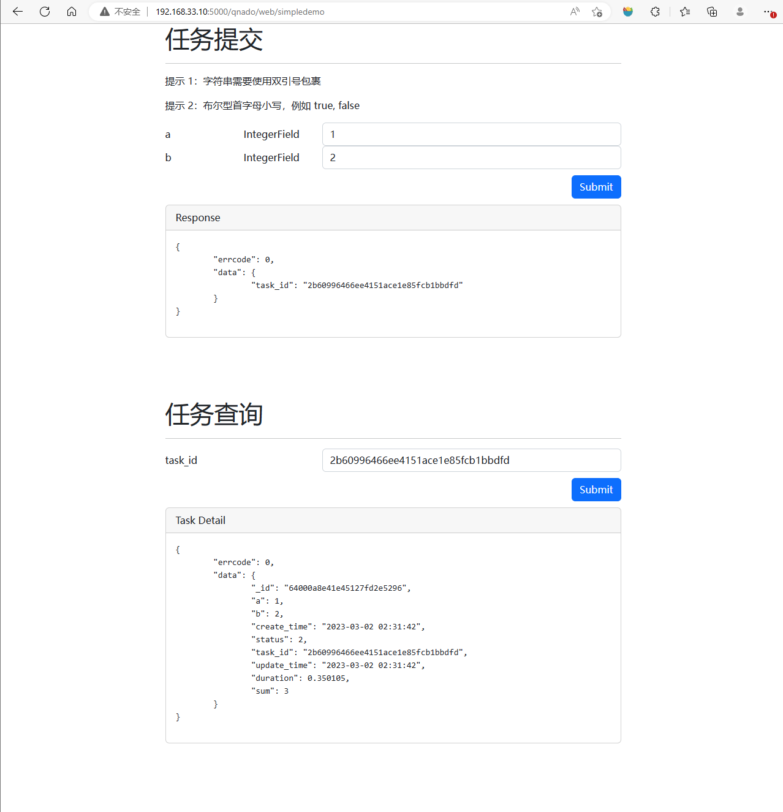
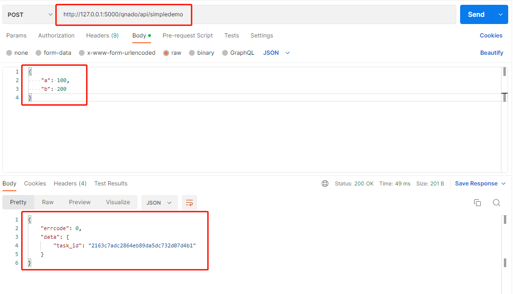
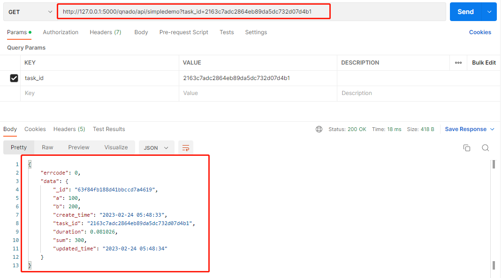

# Qnado 框架使用文档

## 版本记录

| 编号 | 版本   | 时间      | 备注                         |
| ---- | ------ | --------- | ---------------------------- |
| 1    | v0.1   | 2023/3/2  | 第一个版本                   |
| 2    | v0.2   | 2023/3/9  | 添加了 swagger-ui            |
| 3    | v0.2.1 | 2023/3/13 | 优化了日志、模块导入等细节   |
| 4    | v0.2.2 | 2023/3/15 | 支持 server, celery 独立部署 |

## Qnado 简介

### 背景

基于公司目前算法产品的研发流程，提出一个通用框架的概念，着力于降低算法开发者的负担，简化操作，降低使用门槛，追求开箱即用的效果。

### 使用场景和特点

当一个算法开发完成后，Qnado 可以帮助实现下列功能：

- 将算法封装成 REST API
  - 可通过 POST 请求来调用算法，完成一次任务的执行
  - 可通过 GET 请求来查询任务的状态和结果
- 提供 web 页面来提交和查看任务
- 使算法以异步任务的形式被调用，由 Qnado 自动维护任务队列
- 将任务执行的结果自动保存至数据库
- 开发流程标准化（效率提升 30%），减少错误的引入，降低沟通成本
- 提升算法项目的模块化程度，降低部署和维护成本
- 集成 oss 上传工具，摆脱对本地文件的依赖
- 为用户添加的算法任务自动生成 API 接口文档

下列功能正在开发中：

- 提供批量测试功能，可用于性能测试和稳定性测试，并且自动生成测试报告
- 自动评估算法运行对内存的要求
- 自动评估算法任务在不同数量的 cpu 时的性能表现（并行性能）
- 更多功能正在规划中...

## 安装

### 环境要求

- 操作系统： Linux, masOS
- Python： >=3.6

### 通过 pip 安装

使用对应版本安装包的 url 来完成安装。

当前最新版为 v0.2.2，安装示例如下：

``` bash
pip install http://192.168.20.70:9000/qnado-app/qnado/dist/qnado-0.2.2-py3-none-any.whl
```

其他版本下载地址：

- v0.1.1: http://192.168.20.70:9000/qnado-app/qnado/dist/qnado-0.1.1-py3-none-any.whl
- v0.2.0: http://192.168.20.70:9000/qnado-app/qnado/dist/qnado-0.2.0-py3-none-any.whl
- v0.2.1: http://192.168.20.70:9000/qnado-app/qnado/dist/qnado-0.2.1-py3-none-any.whl

### 测试是否安装成功

可以直接执行 qnado 命令，如果没有报错，即代表已经完成安装。

``` bash
$ qnado
* You should use some command. For example: qnado run test.py
```

## 运行 demo

安装完成后，执行以下命令来启动服务

``` bash
qnado demo
```

如果启动正常，将看到如下输出：

``` bash
$ qnado demo
[I 230313 09:03:00 baseapi:43 pid=30065 tid=140471492456576] * Start to loading user module ...
[I 230313 09:03:00 baseapi:46 pid=30065 tid=140471492456576] * Successfully loaded user module: qnado.demo.simple_demo
 
 -------------- celery@ubuntu-bionic v4.4.7 (cliffs)
--- ***** ----- 
-- ******* ---- Linux-4.15.0-206-generic-x86_64-with-glibc2.17 2023-03-13 09:03:01
- *** --- * --- 
- ** ---------- [config]
- ** ---------- .> app:         __main__:0x7fc20ee65040
- ** ---------- .> transport:   redis://:**@192.168.20.61:6379/3
- ** ---------- .> results:     redis://:**@192.168.20.61:6379/6
- *** --- * --- .> concurrency: 4 (prefork)
-- ******* ---- .> task events: OFF (enable -E to monitor tasks in this worker)
--- ***** ----- 
 -------------- [queues]
                .> ubuntu-bionic_simpledemo_queue exchange=celery(direct) key=ubuntu-bionic_simpledemo_router
                

[tasks]
  . qnado.tasks.async_task_launcher

[I 230313 09:03:01 main:40 pid=30065 tid=140471492456576] * Successfully launched Celery workers.
[I 230313 09:03:01 server:58 pid=30073 tid=140471492456576] Tornado server started on port 5000.
[I 230313 09:03:01 server:62 pid=30073 tid=140471492456576] URL of TASK API: http://127.0.0.1:5000/qnado/api/simpledemo
[I 230313 09:03:01 server:62 pid=30073 tid=140471492456576] URL of TASK WEB TOOL: http://127.0.0.1:5000/qnado/web/simpledemo
[I 230313 09:03:01 server:65 pid=30073 tid=140471492456576] URL of swagger-ui: http://127.0.0.1:5000/qnado/api/doc
```

在上面的输出的末尾有如下信息需要注意：

- URL of TASK API: http://127.0.0.1:5000/qnado/api/simpledemo
  - 这是 rest api 的地址
- URL of TASK WEB TOOL: http://127.0.0.1:5000/qnado/web/simpledemo
  - 这是调试页面的地址，可以用浏览器直接打开
- URL of swagger-ui: http://127.0.0.1:5000/qnado/api/doc
  - 这是 API 接口文档的地址

### 在浏览器中测试

这个 demo 实现的是一个简单的加法逻辑，现在在浏览器中打开如下地址即可在页面中提交任务和查询任务。（ip 地址根据实际情况进行替换）

``` bash
http://192.168.33.10:5000/qnado/web/simpledemo
```



任务结果中的字段说明：

- _id：在数据库中的 id 号
- a，b：算法的输入值（由用户的配置生成得到）
- sum：算法的结果值（由用户的配置生成得到）
- status：任务状态（0：已提交，1：执行中，2：已完成，-1：执行失败）
- task_id：任务的唯一 id 号
- create_time, updatetime：任务的创建时间，任务信息的最新更新时间
- duration：任务执行的总耗时

### API 接口调试

现在使用 HTTP 调试工具来调试这个接口。（可以使用 curl 或 Postman 等，下文使用的是 Postman）

通过 POST 请求来提交任务。得到一个 task_id 为 2163c7adc2864eb89da5dc732d07d4b1 的任务。



通过 GET 请求来查询上面提交的任务。



### demo 对应的用户文件

上面运行的 demo，实际上使用了如下的用户文件。换言之，如果要实现上面的服务，你只需要提供下面这样一个 py 文件。在实际使用中，你可以通过执行命令： qnado create <prj_name> 来自动生成一个模板文件，然后将具体的内容填入即可。

``` python
from qnado.web.base_api import BaseAPI, Argument
from qnado.fields import (
    IntegerField, FloatField, StringField, BoolField, ListField, DictField)

class SimpleDemo(BaseAPI):
    @staticmethod
    def FUNCTION(a, b):     # 这里改为实际任务的输入参数

        sum = a + b         # 在这里编写任务代码，或者直接调用对应任务

        return {
            'sum': sum      # 这里以键值对的形式输出结果数据
        }

    # 在下方定义输入参数的数据类型
    a = Argument(Argument.INPUT, IntegerField)
    b = Argument(Argument.INPUT, IntegerField)

    # 在下方定义结果参数的数据类型
    sum = Argument(Argument.OUTPUT, IntegerField)

```

### 编写自己的项目

先在项目的根目录下执行如下命令

``` bash
qnado create <prj_name>

# 示例
qnado create FindMol

```

执行后会根据提供的 prj_name 的小写字母来生成 api 文件，上方示例对应生成的文件为 findmol.py：

findmol.py 的文件内容：

``` python
from qnado.web.base_api import BaseAPI, Argument
from qnado.fields import (
    IntegerField, FloatField, StringField, BoolField, ListField, DictField)

class FindMol(BaseAPI):
    @staticmethod
    def FUNCTION(a, b):     # 这里改为实际任务的输入参数

        sum = a + b         # 在这里编写任务代码，或者直接调用对应任务

        return {
            'sum': sum      # 这里以键值对的形式输出结果数据
        }

    # 在下方定义输入参数的数据类型
    a = Argument(Argument.INPUT, IntegerField)
    b = Argument(Argument.INPUT, IntegerField)

    # 在下方定义结果参数的数据类型
    sum = Argument(Argument.OUTPUT, IntegerField)

```

上面的文件中预置了一个可运行的示例，可以在此基础上来完成自己的 api 文件。

至此，可以执行如下命令来启动项目：

``` bash
qnado run findmol.py
```

## 命令列表

``` bash
# 获取帮助
qnado help

# 运行内置的 demo
qnado demo

# 创建项目模板
qnado create <prj_name>

# 启动项目
qnado run <your_api_file.py>

# 启动项目，但只启动 API 服务
qnado runserver <your_api_file.py>

# 启动项目，但只启动 TASK WORKERS
qnado runcelery <your_api_file.py>

```

## 辅助工具

### OSS 的使用（对象存储）

某些项目中，算法的执行结果中会有一些是以文件的形式存放的，例如图片、文本文件等。为了便于更好的与前端页面做交互，需要将这些文件上传至 OSS 中，然后将文件的 URL 作为结果数据。举例如下：

``` python
from qnado.helpers.oss_client import oss            # 导入 oss 组件
url = 'prj_a/abc.cfg'                               # 设置文件访问路径
file = 'abc.cfg'                                    # 想要上传的文件
file_url = oss.put_object_from_file(url, file)      # 得到文件的 url
print(file_url)
```
